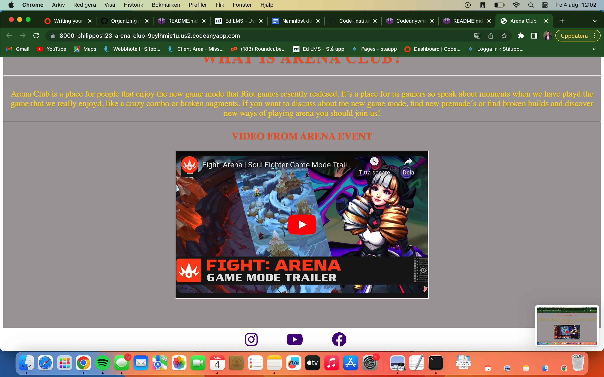
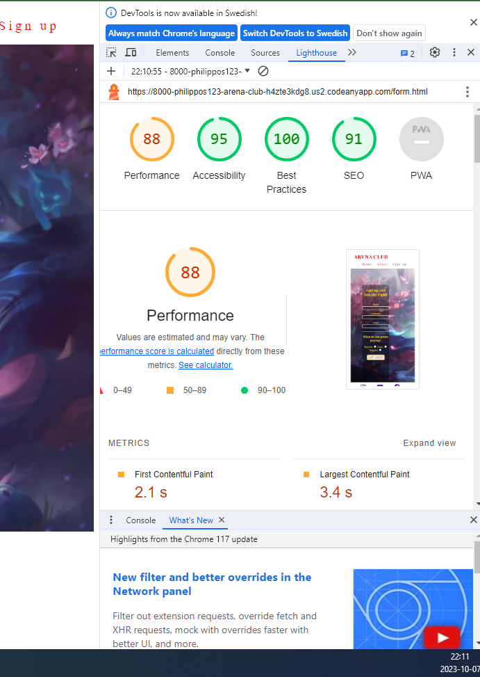

![Responsiv] (assets/css/images/Ima.png)

Arena Club is a site that will help gamers to find new friends and new ways to enjoy the game. This website will target younger gamers. We target young gamers because they may not have many friends and at a young age. It is crutical to have friends and people to look up to. I aim to create a site for boys between 12-19 years old. They come to Arena-club to find new friends and find new way of playing the game. When they sign up they will recive a Discord invite and a clan invite for the game to join with. The reason why they will come back to the site is to see if there are any new updates or new channels to join. 

# Features.

Navigation bar- In the navigation bar in the top right corner there are 3 links to Home, About and Sign up.

This section will allow the user to easily navigate the website and find the information it needs.

# Landing page.

The landing page includes a hero image wich shows the amout of action the player can expect.  With some text over the hero image with encouraging words and a button to easily get to the sign-up form.
This section lets the user see a bright colorful game with much action to get them hyped for the game mode.

# Club Arena description-

The Club Arena description lets the user read and understand more about what Arena Club is about and what we use it for.

The section provides a reason for signing-up and encourage users to join the Club to get new friends and new ways to enjoy the game.

Video section-
Underneath the description of Arena Club is a trailer from the gamemode that shows game mode. Video is created by Riot games for there game League of legends

This section is for the newer players that haven´t played the game mode and don´t know about it yet

# Footer
In the footer, we have links with icons to our social media that takes them directly to our social media when they press the buttons.
The footer is valuable for the user who wants to take a deeper look in what we are doing.

# About
The About page has a hero image similar to the main page with other text.
The goal of the inheritance is to make the user feel comfortable and recognize the layout.

# About Club Arena
Underneath there is a colorful background image of the arena that the players will enter and some text that explains wich company the arena game mode is coming from and who is the launcher of the mode.
This section is for users who want an extra peak at what Arena Club is all about.

# Sign up-
The sign-up page is a full-cover background image of a character from the game that gave people an inviting vibe. On top of the background image is there a form with transparent background
The goal of the sign up form is to get people to join our club.

# Future Left to Implement-
I would like to give all the buttons and links a hover effect.
Try out some other fonts colors and font styles.
Create a discord channel and start a clan!

# Testing
Testing of the site went well. I tried to move around in the navigation bar without any difficulty. 
I tried to submit the form without filling in the blanks wich didin´t work. So i hade to fill in form first and when i press submit it takes me back to Index.html as i planned. I tried the anchors for youtube, instagram and facebook wich created a new tab aswell and took me to the correct website.
I also run the websites in lighthouse. Im a bit dissapointed in the "Perfromance" But i know it´s because of the big images. 

# Validator Testing

_HTML_
-One error was found in the Validator which was
Error: A charset attribute on a meta element found after the first 1024 bytes.
At line 650, column 21
 charset="utf-8"><link rel="i
 I wasn´t able to locate this error W3C validator
 I tried w3c validator for Index.html, about.html and form.html

_CSS_
-No Error was found in the validator for CSS(Jigsaw) validator

# Deployment
- The site was deployed to GitHub pages. The steps to deploy are as follows.
- In the github repository, navigate to the settings tab.
- From the source section drop down menu, select the Master Branch
- Once the master branch has been selected, i waited a couple of minutes for the page to provide a link for the completed website.

The link can be you find here 

# Credits

- Media
  The images was taken from Riot Games own website for ther game League of legends <https://www.leagueoflegends.com/en-gb/>

- Content
  I took inspiration from the Love Running project. <https://philippos123.github.io/Arena-club/>
  

